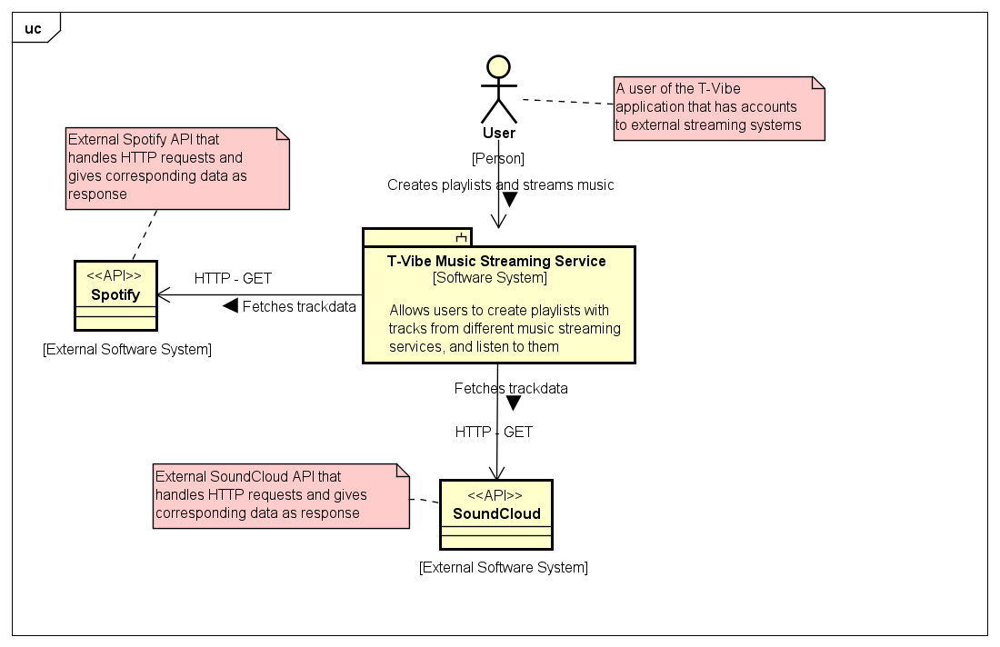
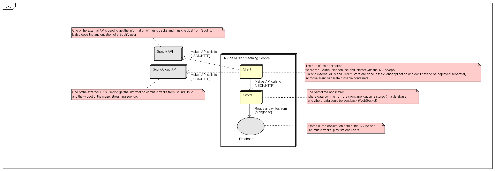
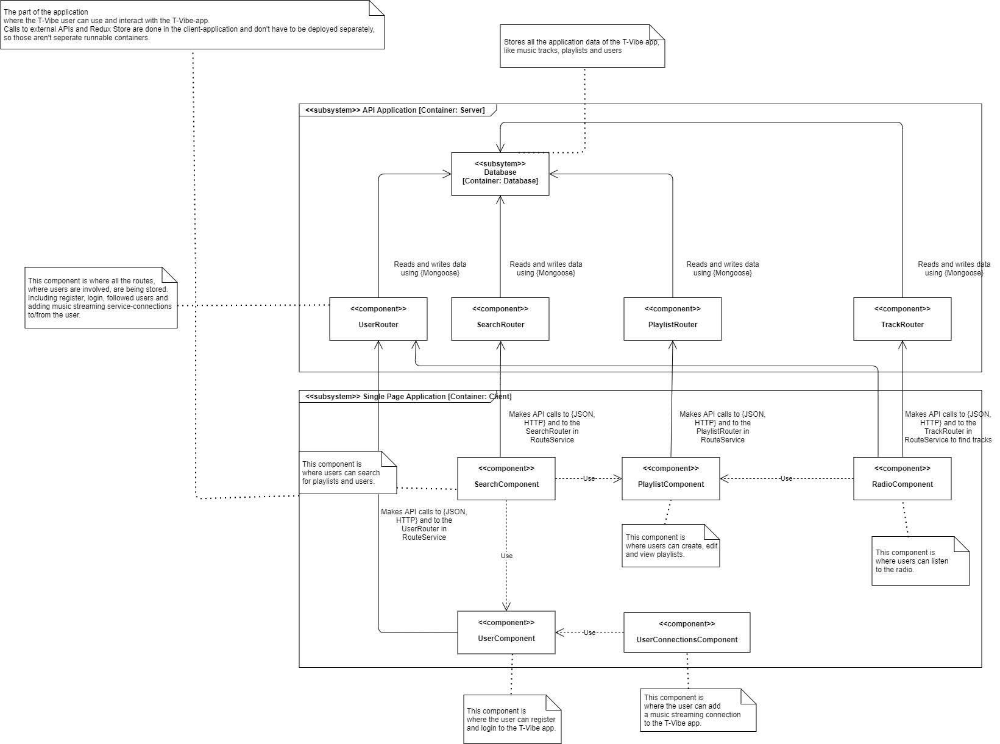
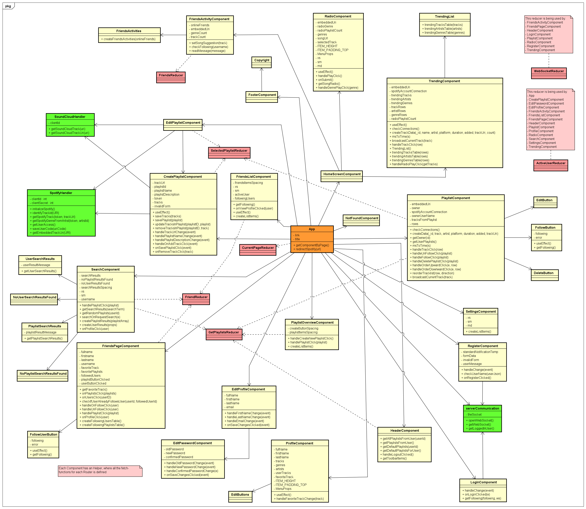
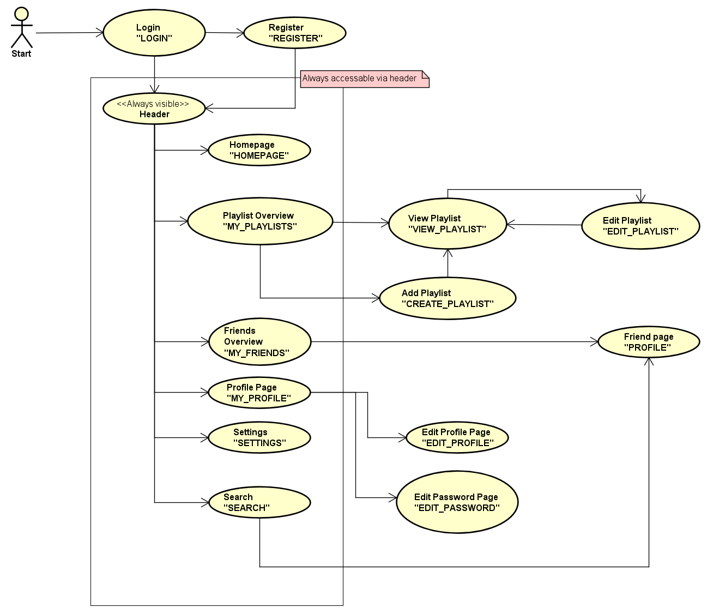
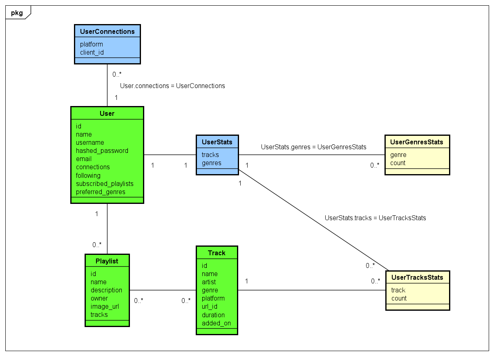
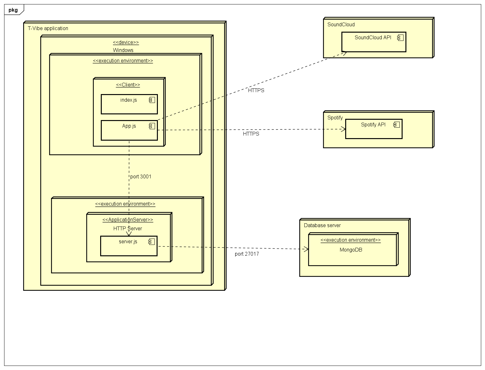

# Software Guidebook
Alan T

## Context

For the DWA (Developing Web Applications)-course we, Team Alan T, had the opportunity to come up with a new project idea. The project has to be an application that implements functionalities that correspond with the technologies from the course. It also needs to be completed within 8 weeks. The assignment could be anything, so we had to narrow it down to something that is relatively possible within the given criteria.

We thought about which problems there currently are and if we could potentially fix those problems with our application. We came up with the idea of combining multiple music platforms into one single platform. Since there are so many songs that are not available on all platforms, we thought it would be handy to be able to create playlists from all different types of platforms. This is how T-Vibe was born.

T-Vibe is a music platform, designed to both discover and share new music. It currently has integrations with popular music sites like Spotify and SoundCloud so that you can listen to songs from different platforms. You can create playlists filled with your favorite songs of your favorite artists and genres.
On T-Vibe you’ll not only listen to the world’s most popular songs, but you can also discover new and innovative music. You can also discover upcoming artists.

When using T-Vibe, you can use your existing accounts of platforms like SoundCloud and Spotify to stream your music and share whatever you're listening to with your friends and family while discovering new music in the process together. You can also see what your friends are currently listening to and find the most trending songs, artists, and genres in the application. 
T-Vibe tracks your real-time favorite songs, artists, and genres so that you can not only find new songs but also share your favorite songs, artists, and genres with your friends.

Getting tired of listening to a playlist repeating itself? T-Vibe is provided with a radio station where you can choose what kind of music you would like to listen to. The most popular and trending songs, artists, and genres are played here. You'll be able to listen to those new hit songs everyone is talking about while you discover new artists and genres.

Currently, the T-Vibe application only supports tracks from the platforms SoundCloud and Spotify. 
Looking further ahead, T-Vibe could add YouTube (YouTube Music) as a music streaming service as well. 
Our application will use these platforms solely to retrieve tracks and stream them with a widget from their respective platforms. Creating, editing, and streaming playlists are currently supported by the T-Vibe application. Users can listen to their or someone else's playlists filled with their tracks. You can also listen to the radio if you want to discover some new music. 

The T-Vibe application is still under construction. To get a good look at which functionalities could be implemented, take a look at the defined [User Stories](./User%20Stories.md).

Here you can see how T-Vibe fits into the big picture: 

## Functional Overview
In this chapter, we will expand on the context and describe the major functionalities that the T-Vibe application will have.
First, it is important to understand who is going to use the system. The following users can use the T-Vibe application:
- T-Vibe user. This is someone who will use the application to listen to their favorite songs.

Now that we know who is going to use the application we can look at what they can do. In short, you will be able to do the following things using the T-Vibe application:
- T-Vibe users can create playlists based on the music they like to listen to on different platforms such as Spotify and SoundCloud.
- T-Vibe users can add songs to the playlist you created.
- T-Vibe users can change the order of the songs in a playlist. 
- T-Vibe users can see the most trending songs, genres, or artists of the application. 
- T-Vibe users can listen to the radio.
- T-Vibe users can search for playlists to explore more music.
- T-Vibe users can search for users to follow their friends and other users.
- T-Vibe users can follow another T-Vibe user to see what kind of music they like.
- T-Vibe users can follow a playlist of another T-Vibe user.
- T-Vibe users can change their personal information and preferences.
- T-Vibe users can check their real-time top 10 songs, artists and genres, and share that with their followers.
- T-Vibe users can see suggested songs of the genres they like.
- T-Vibe users can select the most favorite song to share the song with their followers.
- T-Vibe users can see their friends in an overview.
- T-Vibe users can see music preferences and other information, like what playlists the specified friend follows, on an individual friend page.

For all the User Stories, created based upon these functionalities, please see the document [User Stories](./User%20Stories.md).

## Wireframes
For the wireframes of the T-Vibe application, see the directory [Wireframes](wireframes) for the images.
There are wireframes for the following pages:

|Subject   |Original wireframe   |Actual user interface   |
|---|---|---|
|Sign up   |[Wireframe](wireframes/SignUpWireframe.png)   |[Image](wireframes/SignUpUI.png)   |
|Login   |None   |[Image](wireframes/LoginPageUI.png)   |
|Home page   |[Wireframe](wireframes/HomePageWireframe.png)   |[Image](wireframes/HomePageUI.png)   |
|Settings (connections) page   |None   |[Image](wireframes/SettingsPageUI.png)   |
|Profile page   |[Wireframe](wireframes/ProfilePageWireframe.png)   |[Image](wireframes/ProfilePageUI.png)    |
|Edit profile page   |None   |[Image](wireframes/EditProfileUI.png)   |
|Edit password page   |None   |[Image](wireframes/EditPasswordUI.png)   |
|Playlist page   |[Wireframe](wireframes/PlaylistPageWireframe.png)   |[Image](wireframes/PlaylistPageUI.png)   |
|Tracks in a playlist page   |[Wireframe](wireframes/TracksInPlaylistWireframe.png)   |[Image](wireframes/TracksInPlaylistUI.png)   |
|Playlist creation page   |[Wireframe](wireframes/PlaylistCreationPageWireframe.png)   |[Image](wireframes/PlaylistCreationPageUI.png)   |
|Playlist edit page   |[Wireframe](wireframes/EditPlaylistWireframe.png)   |[Image](wireframes/EditPlaylistUI.png)   |
|Friends page   |[Wireframe](wireframes/FriendsPageWireframe.png)   |[Image](wireframes/FriendsPageUI.png)   |
|Search users/playlists page   |[Wireframe](wireframes/SearchFunctionWireframe.png)   |[Image](wireframes/SearchFunctionUI.png)   |
|Search users/playlists without results page   |[Wireframe](wireframes/SearchFunctionNoResultsWireframe.png)   |[Image](wireframes/SearchFunctionNoResultsUI.png)   |
|Individual friend page   |None   |[Image](wireframes/FriendPageUI.png)   |

Note that the contact us page doesn't have a wireframe because the contact us page does not have any unique things and does not have hidden risks. There are also no wireframes for pages that have been decided later in this project, however, it does have an actual screenshot (Image) of these pages. 

## Quality Attributes

These are the Quality Attributes defined for the T-Vibe application.
The Quality Attributes are defined according to the [ISO25010-standard](https://iso25000.com/index.php/en/iso-25000-standards/iso-25010).

|Code   |Quality Attribute Requirement    |Quality Attribute   |
|---|---|---|
|QAR1   |The music streaming service must be developed as a web application, with Windows as operating system  |Portability   |
|QAR2   |The music streaming service shows a user-friendly error when a user fills in an incorrect value in an input field   |User Error Protection   |
|QAR3   |The music streaming service gets the information of a playlist within 2 seconds from the database, to retrieve the required data   |Time behaviour   |
|QAR4   |The music streaming service uses labels to indicate what to fill in at each input field |User Error Protection   |
|QAR5   |A component can be added to the music streaming service without affecting other components of the service   |Modularity   |
|QAR6   |The user of the music streaming service has to access the external API, with the client-id of the T-Vibe application, of the specified API  |Integrity  |
|QAR7   |The music streaming service must be deployed in a production environment   |Installability   |
|QAR8   |A component in the music streaming service can, through a default component template, be reused   |Reusability   |
|QAR9   |Normal user operations in the music streaming service should never produce errors   |Maturity   |
|QAR10   |An added track must be shown in the playlist within 5 seconds   |Time behaviour   |
|QAR11   |The music streaming service system deploys functionalities, that are validated, within 30 minutes to the production environment   |Time behaviour   |
|QAR12   |The music streaming-homepage provides, in short, information about the application, to inform a user if he/she can use the application for its needs   |Appropriateness recognizability  |
|QAR13   |The user of the music streaming service can only access its personal information and data, and not from other users |Confidentiality   |

## Constraints
This section summarises the constraints that the development team has to work within. These constraints give a small view of the project boundaries and the decisions that have already been made.

| Code | Constraint |
|--|--|
| C1 | The client application must be developed (in part) with Redux |
| C2 | The application must be configured in Node.js |
| C3 | The use of a relational database in this project is prohibited unless there is a good reason to do it partly relational |
| C4 | The communication between the clients and the server is handled by HTTP requests and WebSocket messages|
| C5 | The development team will stop working on this project after 8 weeks, even though the application might not be finished |
| C6 | The functionalities of the application are limited by the usability of the external API's |
| C7 | This project requires the knowledge and technologies from the DWA-course |

## Principles
This chapter is about design principles.

* All database functionality will be stored as methods in de Mongoose schemes
* All business logic will be handled by the server
* Input errors will be checked by both the client and the server
* CSS will mainly be used to tweak the Material-UI's lay-out. Material-UI is leading
* All code will have to be made manually, except for free/open-source frameworks and plug-ins
* All components should share the same parent state, but only use the part that's needed per component
* The use of external API's should be limited to those that are necessary, to not take unnecessary risks regarding potentially deprecated or changed endpoints
* All server calls should be made in the deepest possible levels of the React Components, under the Redux principles
* Use JSON as much as possible for communication

## Software Architecture

In this chapter, we give an overview to help everybody understand the structure of the software.
For this chapter, we made two sorts of diagrams: a Container Diagram and a Component Diagram.

### Container Diagram

This is the container diagram of the T-Vibe application.
The container diagram has a glossary next to each container and the diagram is shown below:

As you can see, to get the information of the music tracks and authorization of a user from each music streaming service, the user can connect to each music streaming API (SoundCloud and Spotify). This is done through the HTTP-protocol and data format 'JSON'.
This will allow easier communication between the client and the specified music streaming API. 

The following versions of each API are:

- Spotify API version 1 (V1)
- SoundCloud API version 2 (V2)

For the communication between Client and Server, the communication is also done through the HTTP-protocol and data format 'JSON'.
This will allow for easier communication between the two containers/applications. 
The communication between Server and Database is done with the Mongoose API, where NoSQL-calls can be done to and from the database.

### Component Diagram

This is the component diagram of the T-Vibe application.
The component diagram has a glossary next to each component and the diagram is shown below:

The most significant components of each subsystem and the protocols and frameworks at each connection arrow has been mentioned in this diagram.
The containers of each subsystem have been mentioned as well. 

## External Interfaces
This section summarises all the external interfaces that are used in this application.

### Key external interfaces
In this project, there are two necessary external interfaces. These interfaces provide data that is required to implement the project's functionalities. Here is a small summary of these external interfaces:

* Spotify API
* SoundCloud API

### Technical
| **Interfaces** | Spotify API | SoundCloud API |
|----------------|-------------|----------------|
| **Definition** | Retrieving data from tracks/playlists/users | Retrieving data from tracks/playlists/users |
| **Message format** | JSON | JSON |
| **Sync/Async** | Asynchronous | Asynchronous |
| **Idempotent** | No | No |
| **100% availability** | No | No |
| **Security** | Client id & Client secret | Client id |

### Non-technical
| **Interfaces** | Spotify API | SoundCloud API |
|----------------|-------------|----------------|
| **Owner** | Spotify | SoundCloud |
| **Agreements** | [Terms of Service](https://developer.spotify.com/terms/) | [Terms of Use](https://developers.soundcloud.com/docs/api/terms-of-use) |

## Code
In this chapter, we will explain the implementation of our application, so that everybody understands how the
important/significant/complex parts of the software system work.
That way, everybody can maintain, update, and extend these parts consistently and coherently.

### Class diagram

This is the class diagram of the T-Vibe application.
This diagram contains all the React components, Express routers, database models, and some essential helper classes, which will be explained underneath.
The helper-classes of the React components will not be noted in the Class diagram, because there is too much correlation between the helper-class and its parent.
Like CreatePlaylistComponentHelper (helper-class) and CreatePlaylistComponent (parent). 
Note that all of the server routers are defined in the [component diagram](#component-diagram).
Also, note that all of the data models are defined in the [domain model](#domain-model).

To explain what the different arrows mean, the following diagram legend will explain these arrows:
- <b>Intermittent arrow</b>: These arrows show which reducer is connected to each component when a component sends and saves information to each reducer, kind of like a dispatch (Dependency arrow in Astah).
- <b>Association arrow</b>: These arrows show which components are being used by other components. This includes components connected to its helper class. Because the app is single page, the App component has a lot of association arrows (Association arrow in Astah).

The ActiveUserReducer and the WebSocketReducer are used in too many components to use an intermittent arrow to connect these reducers to each component. That is why, for each reducer, we created a note that states all the components that use this specific reducer.

To explain the colors of each 'class', the following diagram legend will explain these colors:

- <b>Yellow</b>: the React components in the T-Vibe application.
- <b>Green</b>: essential helper-classes worth noting in the diagram. These are in this case the external music streaming API classes like SpotifyHandler, or a server communication file like 'serverCommunication'.
- <b>Red</b>: the Redux reducers in the T-Vibe application.
- <b>Orange</b>: App.js, which is the main communication point in the whole application. 

### REST API and WebSocket specification

Please see the file [REST API Specification](./REST%20API%20Specification.md) for the in-detail endpoints.
To get a quick overview, see the route-files themselves: [user.js](../t-vibe_app/server/routes/user.js), [playlist.js](../t-vibe_app/server/routes/playlist.js), [track.js](../t-vibe_app/server/routes/track.js), [search.js](../t-vibe_app/server/routes/search.js).
Please see the file [Websockets Specification](./WebsocketSpecification.md) for the websocket specification.

### Redux-state
The Redux-state contains all information relating to the current state of the entire client-side application. Here is all the information stored:

| **State** | **Datatype** | **Description** | **Actions** |
|-----------|--------------|-----------------|-------------|
| `getPlaylists` | String | The playlists of a user (more info in [next chapter](#routing)) | `getPlaylists` |
| `currentPage` | String | The page-code for the currently active page (more info in [next chapter](#routing)) | `redirect` |
| `selectedPlaylist` | Object (playlist) | The object of the current playlist. Will be `null` if no playlist is selected. This object is used for the view- and edit-playlst components | `selectPlaylist` |
| `activeUser` | Object (user) | The object of the currently logged in user | `logIn`, `logOut` |
| `friends` | Array (usernames) | List of users that the active user follows | `friends` |
| `webSocket` | Object (webSocket) | The object of the currently connected webSocket | `webSocket` |
| `friend` | Object (friend) | The object of the selected friend of a user | `friend` |

### Routing
In the client application, all the routing is implemented as a single variable in the Redux state. This makes the application a complete single-page since no URL routing is needed.
As shown in the last chapter, the Redux state contains a variable named `currentPage`, containing a string. This string is one of several pre-defined page codes, linking to the actual page.
This linking is done in the `App.js`, in a switch-statement. Here are navigational options, with all the page codes, as stored in the Redux state:

### Connections

We have divided the two different APIs into multiple handler-files (directory 'connections'):

* SpotifyHandler.js
* SoundCloudHandler.js

This is to separate the functionalities of each API when all APIs are required.
For example, to get an overview of all the tracks in a playlist, tracks can originally come from multiple APIs.
To play a track, the specified platform (Spotify or SoundCloud) of the track defines which handler it should call.
So for example a Spotify track should call the SpotifyHandler and so on.
Each handler file contains all the functionalities to get the required information of the application, like the track information, 
the genre of a track or just to initialize the connection between the T-Vibe app and the specified API. 

### Testing

You will find the route- and the end-to-end test coverage here: [TestCoverage](https://docs.google.com/document/d/1SrufmeacWyeK44XYyJv_2whIy_Zk96LA1o3SgjPBcEo/edit).  

## Data
In this chapter, we will discuss how the data is stored.  
As discussed before, we will be using a MongoDB database. This database will be using 3 different collections.  
These collections are named as follows:
1. playlists
2. tracks
3. users

To work with the MongoDB database, the properties of these collections have to be defined in schemes. These schemes can be found in the folder [mongooseSchemes](mongooseSchemas). Note that there are more schemes than collections because we decided to cut big collection based schemes into multiple schemes. This is to create a better overview of what information you can find in these collections.

### Domain model
First, we will describe the data structure of the application by making a domain model.
This domain model could also be seen as an ERD (Entity Relationship Diagram), where the cardinality between each domain is defined.
This domain not only contains the defined database collections, but also some embedded domains.
Note that an embedded domain is defined in the text between a relationship between two domains, for example 'User.connections = UserConnections':

To explain the colors of each 'box' in the domain model, the following model legend will explain these colors:
- <b>Green</b>: The MongoDB collections.
- <b>Blue</b>: Schemes that are used in a collection.
- <b>Yellow</b>: Subschemes that other schemes (blue) use. Could also be subcomponents of a schema, like UserGenresStats is the property 'genres' in UserStats.

## Infrastructure Architecture
This section describes the infrastructure of the application.
For the architecture of the application, we would like to refer to the deployment diagram below.
The deployment diagram will explain how and where the software is installed and configured. It will also explain which connections are used to interact with other components.
The external APIs, database server, and T-Vibe application are noted in this diagram. 

## Operation and Support

This chapter describes how to run T-Vibe. Please follow these instructions:

1. *Download the application:*
   - Navigate to the root of the [Git-repo](https://github.com/HANICA-DWA/sep2020-project-alan-t)
   - Download ZIP-file
   - Extract the ZIP-file
2. *Download and install the software:*
   - Install version 8.4 (or higher) of Node.js. Use either [this Windows tutorial](https://nodesource.com/blog/installing-nodejs-tutorial-windows/)
     or [this MacOS tutorial](https://nodesource.com/blog/installing-nodejs-tutorial-mac-os-x/)
   - Install MongoDB version 3.4 or higher. There are [instructions for Windows](https://docs.mongodb.com/manual/tutorial/install-mongodb-on-windows/) and [instructions for MacOS](https://docs.mongodb.com/manual/tutorial/install-mongodb-on-os-x/).
3. *Start the server:* 
   - Make sure the MongoDB server is running on port `:27017`
   - Go to `...\sep2020-project-alan-t\t-vibe_app\server` in your command prompt
   - Run the command `npm install` and wait until it's done
   - Run the command `node server.js`
4. *Start the client:*
   - Go to `...\sep2020-project-alan-t\t-vibe_app\client` in your command prompt
   - Run the command `npm install` and wait until it's done
   - Run the command `npm start`
5. *Go to `http://localhost:3000` in your browser and enjoy!*

The instructions for setting up the server and client individually can be found in their respective folders.

### Tests
1. *Follow steps 1 and 2 from above*
2. *Install both dependencies:*
   - Go to `...\sep2020-project-alan-t\t-vibe_app\server` in your command prompt
   - Run the command `npm install` and wait until it's done
   - Go to `...\sep2020-project-alan-t\t-vibe_app\client` in your command prompt
   - Run the command `npm install` and wait until it's done
3. *Run the unittests:*
   - Go to `...\sep2020-project-alan-t\t-vibe_app\server` in your command prompt
   - Run the command `npm test`
   - Done!
4. *Run the end-to-end tests:*
   - Go to `...\sep2020-project-alan-t\t-vibe_app\` in your command prompt
   - Run the command `npm install` and wait until it's done. (This may take a while)
   - Run the command `npm run e2e`
   - Done!
   
## Decision Log
This section summarizes all the major decisions that we have made during this project. These decisions are about technical implementations, but also about functionalities that may be too large for the development team to implement.
| **Decision** | **Explanation** | **Alternatives** |
|--|--|--|
| Implement only a list of "Following" instead of implementing a list of "Followers" as well | It increases the integrity of the system because we don't have to update both lists when a change has been made to one of them | Implementing both lists (increases performance but at the cost of integrity) |
| Creating a single page application | We decided that, since we were going to use Redux, it would be a good idea to create a single page application and store information in the Redux state | Use React routing instead of creating a single page application |
| Track how many times a user has listened to a specific track/genre with a counter | It's easier to generate a top 10 rankings, for a user, based on tracks and genres when there is a counter attached to every track/genre | Attach a hardcoded rank to a track/genre in the database |
| Genres will not be normalized in the T-Vibe application | Every language has it's own way of filtering and displaying genres. We limit ourselves to 1 language: English (EN-US). | Localizing the genres based on the user's location so that the genre affects the users preferred language |
| Implement a widget that plays a track based on the provided link without automatically playing the next track after the first has ended. The user has to manually change the track that he wants to play.| It takes too much time to implement a fully functional widget and since it's not a functionality that will be evaluated as hard as the other functionalities of the application, we won't spend too much time trying to implement a widget | Implementing a fully functional widget or dropping the use of a widget completely (if it's not working as intended) |
| A user can have 0 playlists and a playlist can have 0 tracks in it | Otherwise a user has to have a predefined playlist that he didn't make. This also allows the user to delete all of the tracks from a playlist | Creating a minimum amount of tracks in a playlist |
| The music streaming services in the client-application are divided into multiple handler-files | To separate the functionalities of each API when the APIs are required in a component. For example to determine which API should be called for the required information | Put all functionalities of each API in one file |
| We are not going to check if the user stops listening to a track | We are going to assume that a user is still listening to the same song as long as that user does not click on another track. If we are going to check if the user is still on the playlist page listening to the track then we will have to put a check on almost every button that makes the user leave the page. The team has decided that this is not an option for T-Vibe | Show that the user is listening to a track until he/she clicks on another track, then show that track, etc. |
| Genres of each song in the application, whether the song is coming from Spotify or SoundCloud, saved as lower-case in the database of the application | To prevent duplicate genres in the application, like 'House' and 'house' | Use the 'toLowerCase'-function in the client-application to solve the problem as explained | 
| We are not going to use the official Mongoose references in the Mongoose schemes | If we are going to use the official Mongoose references in the Mongoose schemes, we will have to rewrite most of the routes in the backend | Keep the future routes consistent with the existing routes |
| We decided to cut big collection based schemes into multiple schemes | To create a better overview of the information in the collections | Only use collection based schemes |
