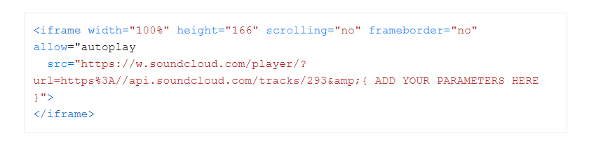
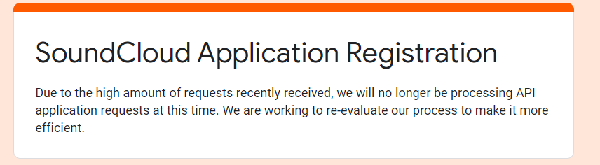
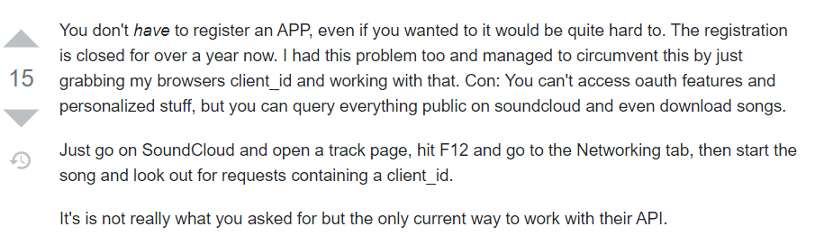
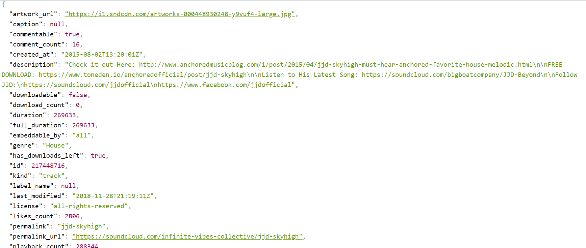

# Research SoundCloud

<b>Vu Le</b>
<br>
12 november 2020
<br>
Reviewed by:

## Purpose

The purpose of this research is to explore some elements of the SoundCloud API, that are useful for the T-Vibe application.

## Main and sub questions

### Main question
Which aspects of the SoundCloud API can be used for this project?

### Sub questions
* What aspects and how can these aspects be implemented in this project?
* What are some technical pros and cons about the SoundCloud API?

## Elaboration
### What aspects and how can these aspects be implemented in this project?
For the T-Vibe app, we need a few things:

- a widget to play the track
- all the track-information from the SoundCloudUri (most importantly the Track URI) needed to play the widget

To find out what is needed for the widget, I went to the website of the Widget API of SoundCloud and some example code of how to recreate the widget:



I noticed that what was needed was the Track URI of the track that I wanted to play.
Sounds easy right? No.
The permalink URL of a track that a user has from SoundCloud doesn't have the track id inside.
Like:

```
https://api.soundcloud.com/tracks/217448716
```

You also can't access the SoundCloud API without your own client-id.
Which means that you have to get your client-id.
But unfortunately, the SoundCloud Developers-team decided that users can't register their app anymore to SoundCloud Developers:



Which means that normally you won't be able to use the SoundCloud API.
But you can use your browsers client-id to retrieve track-information (https://stackoverflow.com/questions/54753238/soundcloud-application-registration-form-is-closed):



So now when you have your client_id, fetch the track-information:

```js
  const corsProxyUrl = "https://cors-anywhere.herokuapp.com/"
  const trackInfoUrl = "http://api-v2.soundcloud.com/resolve?url=" + uri + "&client_id=" + client.client_id
  const widgetUrl = "https://w.soundcloud.com/player/?url="

    fetch(corsProxyUrl + trackInfoUrl)
      .then(response => {return response.json()})
      .then(result => { setTrackUri(widgetUrl + result.uri); })
      .catch(function (error) {
        console.log(error);
    })
```
For CORS, I used CORS-proxy because I am not working with Express for this research and this was the best solution for enabling CORS in the browser. To get the trackinfo, use the API-link with as path 'resolve' (resolve is to get the information of a playlist or track) and the client_id. 
The function 'setTrackUri' is to set the retrieved Track-URI from fetching the API for playing the track on the widget:

```js
    <div>
      <form onSubmit={handleSubmit}>
        <input type = "text" onChange = {(e) => setUri(e.target.value)}></input>
        <input type="submit" value="Submit" />
      </form>
      <iframe width="100%" height="166" scrolling="no" frameborder="no" src={trackUri} title="soundCloudFrame"></iframe>
    </div >
```

As you can see, there is the IFrame with the TrackUri. Typing in a regular permalink URL of a SoundCloud-track to set the 'uri' for the variable 'trackInfoUrl' and clicking on a button, will activate the iFrame with the retrieved SoundCloud-track to play:


That is how to get a track from SoundCloud to play in a widget for our T-Vibe app.

### What are some technical pros and cons about the SoundCloud API?

During this research, I noticed this about the API:

Cons
- Can't register your app anymore on the SoundCloud API, which means you have to get your client_id from your browser to be able to use the API. It also means that you are limited in using the full API, like you can't access oauth features, personalized content or uploading tracks. 
- When you click the pause-button of the official widget, you have to refresh the widget in order to play the track again.

Pros
- The track-information of a SoundCloud-track is very detailed, which means that we can use the data of each track in multiple ways:



- All the troubles of the client_id aside, with the client_id from the browser, we can still access all the public data from SoundCloud and even download songs from SoundCloud. Which is so far all we need for the T-Vibe app. 

## Conclusion

So, which aspects of the SoundCloud API can we use for this project? The answer is: all the public data, but no oauth features or personalized content. But the public data is basically the only thing the T-Vibe app needs right now and the data is very detailed, so it offers us a lot of flexibility of how to use the data in the T-Vibe-app. So all in all, we can the SoundCloud API to implement the necessary functionalities in the T-Vibe app.

## Literature

SoundCloud Application Registration form is closed. (2019, February 18). Stack Overflow. https://stackoverflow.com/questions/54753238/soundcloud-application-registration-form-is-closed

Widget API - SoundCloud Developers. (n.d.). SoundCloud. Retrieved on November 13, 2020, from https://developers.soundcloud.com/docs/api/html5-widget#parameters

R. (2013, January 3). Rob - W / cors-anywhere. GitHub. https://github.com/Rob--W/cors-anywhere

HTTP API - Reference - SoundCloud Developers. (n.d.). SoundCloud. Retrieved on November 13, 2020, from https://developers.soundcloud.com/docs/api/reference#activities